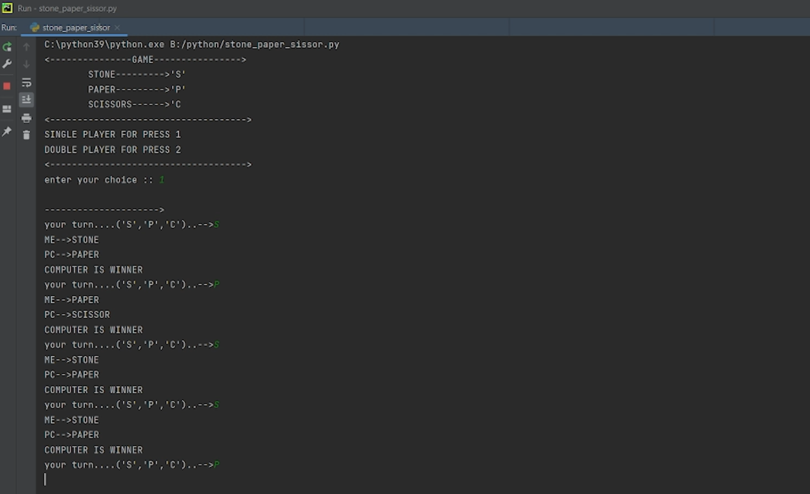
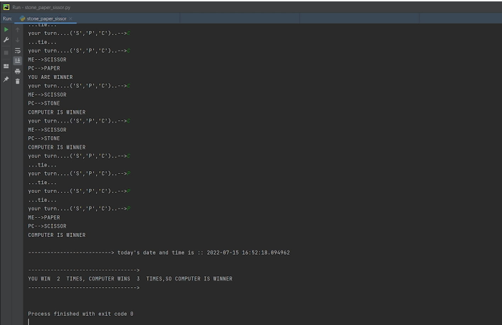

# STONE-PAPER-SCISSORS :star_struck: :open_mouth: :running: :star2:

[](https://shields.io/) [](https://shields.io/) 
<br>

***This new Stone Paper Scissors using Python is created by Biswarup Bhattacharjee, student of BTECH, in University of Engineering and Management, Kolkata.***

**Email Id: bbiswa471@gmail.com.** 

**Contact No: 916290272740.** 


<p align="left">
<a href="https://www.facebook.com/profile.php?id=100070395300810" target="blank"></a>
<a href="https://instagram.com/biswarup2210" target="blank"></a>
<a href="https://github.com/biswa2210" target="blank"></a>
</p>

## About :point_down: 

<div align="justified">
    
This is a stone paper scissors agem. User can start this application ans start playing stone paper scissors. 

</div>

## STONE PAPER SCISSORS DEMO VIDEO: :point_right: <a href="https://www.youtube.com/watch?v=p6ifmHHFuOk&list=PL0lbDlMJ1h4ikgkbohDuJurlnFvGzJCMr&index=8">Click here to watch</a>

## PYTHON PLAYLIST: :point_right: <a href="https://www.youtube.com/watch?v=SsKXFCSfQgw&list=PL0lbDlMJ1h4ikgkbohDuJurlnFvGzJCMr">Click here to watch</a>

## Folder Structure :point_down:

```bash
STONE-PAPER-SCISSORS
    ├── auto.tcl
    ├── clock.tcl
    ├── history.tcl
    ├── init.tcl
    ├── package.tcl
    ├── parray.tcl
    ├── safe.tcl
    ├── tm.tcl
    └── word.tcl
``` 
## Screenshots :point_down: 

<div align="center">
    
<a href="stone1.png"></a> 

<a href="stone2.png"></a>

</div>


